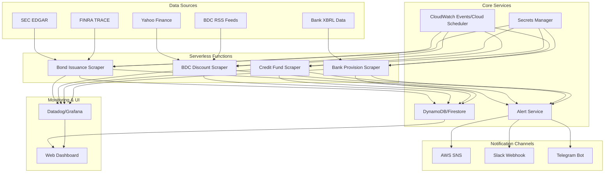

# Design Document

## Overview

The Boom-Bust Sentinel is a serverless financial market monitoring system that automatically collects data from various financial sources, evaluates predefined rules, and sends alerts when significant market conditions are detected. The system follows a microservices architecture using cloud functions, with each data source handled by dedicated scrapers that run on scheduled intervals.

The core design principle is to minimize operational overhead while maximizing reliability and scalability. The system uses a "collect, compare, alert" pattern where each scraper function fetches current data, compares it against historical values stored in a NoSQL database, and triggers alerts when thresholds are exceeded.

## Architecture

### High-Level Architecture



### Technology Stack

**Compute Platform:** AWS Lambda or Google Cloud Functions
- Python 3.9+ runtime for data processing and web scraping
- 15-minute timeout limit requires chunked processing for large datasets
- Memory allocation: 512MB-1GB depending on data processing requirements

**Storage:** DynamoDB (AWS) or Firestore (Google Cloud)
- Single table design with composite keys: `{data_source}#{metric_name}#{date}`
- TTL enabled for automatic cleanup of old data (retain 2 years)
- On-demand billing to handle variable load patterns

**Scheduling:** CloudWatch Events (AWS) or Cloud Scheduler (Google Cloud)
- Daily schedules for most scrapers (6 AM UTC)
- Weekly schedule for bond issuance monitoring (Monday 8 AM UTC)
- Hourly health checks for critical data sources

**Security:** AWS Secrets Manager or Google Secret Manager
- API keys, webhook URLs, and database credentials
- Automatic rotation for supported services
- IAM roles with least-privilege access

## Components and Interfaces

### Data Scraper Functions

Each scraper follows a common interface pattern:

```python
class BaseScraper:
    def __init__(self, data_source: str, metric_name: str):
        self.data_source = data_source
        self.metric_name = metric_name
        self.state_store = StateStore()
        self.alert_service = AlertService()
    
    def execute(self) -> None:
        """Main execution flow"""
        try:
            current_data = self.fetch_data()
            validated_data = self.validate_data(current_data)
            historical_data = self.get_historical_data()
            
            if self.should_alert(validated_data, historical_data):
                self.alert_service.send_alert(
                    self.generate_alert_message(validated_data, historical_data)
                )
            
            self.state_store.save_data(validated_data)
            self.send_metrics(validated_data)
            
        except Exception as e:
            self.handle_error(e)
    
    def fetch_data(self) -> Dict[str, Any]:
        """Implemented by each specific scraper"""
        raise NotImplementedError
    
    def validate_data(self, data: Dict[str, Any]) -> Dict[str, Any]:
        """Data validation and cleaning"""
        pass
    
    def should_alert(self, current: Dict, historical: Dict) -> bool:
        """Alert logic implementation"""
        pass
```

### Specific Scraper Implementations

**Bond Issuance Scraper (`bond_scraper.py`)**
- Fetches SEC Rule 424B filings using `sec-edgar-downloader`
- Parses prospectuses for CIKs: MSFT, META, AMZN, GOOGL
- Extracts notional amounts and coupon rates
- Fallback to FINRA TRACE API if SEC data unavailable
- Alert threshold: >$5B weekly issuance increase

**BDC Discount Scraper (`bdc_scraper.py`)**
- Uses `yfinance` library for stock prices (ARCC, OCSL, MAIN, PSEC)
- Parses RSS feeds from investor relations pages for NAV data
- Calculates discount-to-NAV: `(NAV - Price) / NAV`
- Alert threshold: >5% change in average discount across tracked BDCs

**Credit Fund Scraper (`credit_scraper.py`)**
- Downloads Form PF XML filings from SEC
- Extracts "gross asset value" using XML parsing
- Compares sequential quarters for asset value drops
- Alert threshold: >10% quarter-over-quarter decline

**Bank Provision Scraper (`bank_scraper.py`)**
- Primary: XBRL parsing of 10-Q filings for "AllowanceForCreditLosses"
- Fallback: Earnings call transcript analysis via Symbl.ai API
- Regex search for "non-bank financial" + "provision" keywords
- Alert threshold: >20% increase in provisions quarter-over-quarter

### State Management

**Data Schema:**
```json
{
  "pk": "bond_issuance#weekly#2024-01-15",
  "data_source": "bond_issuance",
  "metric_name": "weekly",
  "timestamp": "2024-01-15T06:00:00Z",
  "value": 12500000000,
  "metadata": {
    "companies": ["MSFT", "META", "AMZN"],
    "avg_coupon": 4.25,
    "source": "sec_edgar"
  },
  "ttl": 1735689600
}
```

**State Store Interface:**
```python
class StateStore:
    def save_data(self, data: Dict[str, Any]) -> None
    def get_historical_data(self, data_source: str, metric: str, days: int = 7) -> List[Dict]
    def get_latest_value(self, data_source: str, metric: str) -> Optional[Dict]
    def cleanup_old_data(self, retention_days: int = 730) -> None
```

### Alert Service

**Alert Message Format:**
```json
{
  "alert_type": "threshold_breach",
  "data_source": "bond_issuance",
  "metric": "weekly",
  "current_value": 15000000000,
  "previous_value": 8000000000,
  "threshold": 5000000000,
  "change_percent": 87.5,
  "timestamp": "2024-01-15T06:15:00Z",
  "context": {
    "companies_involved": ["MSFT", "META"],
    "data_quality": "high",
    "confidence": 0.95
  }
}
```

**Notification Channels:**
- **AWS SNS**: Email/SMS delivery with retry logic
- **Slack**: Rich message formatting with charts and context
- **Telegram**: Bot API with inline keyboards for acknowledgment

### Web Dashboard

**Technology Stack:**
- Frontend: React with TypeScript
- Backend: FastAPI (Python) or Express.js (Node.js)
- Hosting: AWS S3 + CloudFront or Google Cloud Storage + CDN
- Authentication: AWS Cognito or Google Identity Platform

**Key Features:**
- Real-time metric displays with auto-refresh
- Interactive charts using Chart.js or D3.js
- Alert configuration interface
- Data source health monitoring
- Historical data export functionality

## Data Models

### Core Data Types

```python
from dataclasses import dataclass
from datetime import datetime
from typing import Dict, List, Optional, Union

@dataclass
class MetricValue:
    value: Union[float, int, str]
    timestamp: datetime
    confidence: float
    source: str
    metadata: Dict[str, Any]

@dataclass
class AlertThreshold:
    metric_name: str
    threshold_type: str  # 'absolute', 'percentage', 'standard_deviation'
    threshold_value: float
    comparison_period: int  # days
    enabled: bool

@dataclass
class DataSource:
    name: str
    url: str
    update_frequency: str  # cron expression
    last_successful_update: Optional[datetime]
    health_status: str  # 'healthy', 'degraded', 'failed'
    retry_count: int

@dataclass
class Alert:
    id: str
    alert_type: str
    data_source: str
    metric_name: str
    current_value: MetricValue
    threshold: AlertThreshold
    message: str
    channels_sent: List[str]
    acknowledged: bool
    created_at: datetime
```

### Database Schema Design

**Primary Table: `market_metrics`**
- Partition Key: `{data_source}#{metric_name}`
- Sort Key: `timestamp`
- Attributes: `value`, `metadata`, `confidence`, `ttl`

**Secondary Index: `data_source_index`**
- Partition Key: `data_source`
- Sort Key: `timestamp`
- Purpose: Query all metrics for a data source

**Configuration Table: `alert_config`**
- Partition Key: `user_id` (for multi-tenant support)
- Sort Key: `{data_source}#{metric_name}`
- Attributes: `threshold_config`, `notification_preferences`

## Error Handling

### Retry Strategy

**Exponential Backoff Implementation:**
```python
import time
import random
from typing import Callable, Any

def retry_with_backoff(
    func: Callable,
    max_retries: int = 3,
    base_delay: float = 1.0,
    max_delay: float = 60.0,
    backoff_factor: float = 2.0
) -> Any:
    for attempt in range(max_retries + 1):
        try:
            return func()
        except Exception as e:
            if attempt == max_retries:
                raise e
            
            delay = min(
                base_delay * (backoff_factor ** attempt) + random.uniform(0, 1),
                max_delay
            )
            time.sleep(delay)
```

### Data Validation

**Checksum Validation:**
- SHA-256 hashes for downloaded files
- Content-length verification for API responses
- Schema validation using Pydantic models

**Anomaly Detection:**
- Statistical outlier detection (>3 standard deviations)
- Rate-of-change limits to prevent false alerts
- Cross-validation between multiple data sources when available

### Graceful Degradation

**Fallback Mechanisms:**
1. Primary data source failure → Secondary source
2. Real-time data unavailable → Cached data with staleness warning
3. Alert delivery failure → Retry with alternative channels
4. Database unavailable → Local file backup with eventual consistency

## Testing Strategy

### Unit Testing

**Test Coverage Requirements:**
- Data scrapers: 90% code coverage
- Alert logic: 100% coverage for threshold calculations
- Data validation: 100% coverage for edge cases

**Mock Data Strategy:**
```python
# Example test fixture
@pytest.fixture
def mock_sec_response():
    return {
        "filings": [
            {
                "cik": "0000789019",  # MSFT
                "form_type": "424B2",
                "filing_date": "2024-01-15",
                "notional_amount": 2000000000,
                "coupon_rate": 4.5
            }
        ]
    }

def test_bond_scraper_threshold_detection(mock_sec_response):
    scraper = BondIssuanceScraper()
    scraper.fetch_data = lambda: mock_sec_response
    
    # Test threshold breach detection
    assert scraper.should_alert(current_data, historical_data) == True
```

### Integration Testing

**End-to-End Test Scenarios:**
1. Complete data pipeline: fetch → validate → store → alert
2. Multi-channel alert delivery verification
3. Dashboard data consistency checks
4. Error recovery and retry mechanisms

**Test Environment:**
- Separate AWS/GCP accounts for testing
- Mock external APIs using WireMock or similar
- Automated deployment pipeline with test gates

### Performance Testing

**Load Testing:**
- Simulate high-volume data processing
- Test concurrent scraper execution
- Database performance under load
- Alert system capacity limits

**Monitoring Test Metrics:**
- Function execution time (<30 seconds target)
- Memory usage (<80% of allocated)
- Database read/write latency (<100ms)
- Alert delivery time (<5 minutes end-to-end)