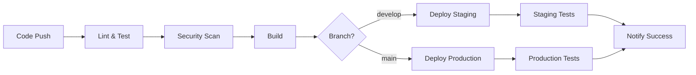

# Boom-Bust Sentinel Deployment Guide

This guide covers the complete deployment and infrastructure automation for the Boom-Bust Sentinel system.

## Overview

The deployment system supports multiple environments (development, staging, production) with automated CI/CD pipelines, infrastructure monitoring, and comprehensive testing.

## Architecture

```
┌─────────────────┐    ┌─────────────────┐    ┌─────────────────┐
│   Development   │    │     Staging     │    │   Production    │
│                 │    │                 │    │                 │
│ • Local testing │    │ • Pre-prod      │    │ • Live system   │
│ • Feature dev   │    │ • Integration   │    │ • Full monitoring│
│ • Unit tests    │    │ • E2E testing   │    │ • Alerting      │
└─────────────────┘    └─────────────────┘    └─────────────────┘
         │                       │                       │
         └───────────────────────┼───────────────────────┘
                                 │
                    ┌─────────────────┐
                    │   CI/CD Pipeline │
                    │                 │
                    │ • GitHub Actions│
                    │ • Automated     │
                    │   Testing       │
                    │ • Deployment    │
                    └─────────────────┘
```

## Prerequisites

### Required Tools

1. **AWS CLI** - For AWS resource management
   ```bash
   # Install AWS CLI
   curl "https://awscli.amazonaws.com/awscli-exe-linux-x86_64.zip" -o "awscliv2.zip"
   unzip awscliv2.zip
   sudo ./aws/install
   
   # Configure credentials
   aws configure
   ```

2. **Node.js & npm** - For frontend and Serverless Framework
   ```bash
   # Install Node.js (version 18+)
   curl -fsSL https://deb.nodesource.com/setup_18.x | sudo -E bash -
   sudo apt-get install -y nodejs
   ```

3. **Python 3.9+** - For backend services
   ```bash
   # Install Python 3.9+
   sudo apt-get update
   sudo apt-get install python3.9 python3.9-pip python3.9-venv
   ```

4. **Serverless Framework** - For Lambda deployment
   ```bash
   npm install -g serverless
   ```

5. **Terraform** (Optional) - Alternative to Serverless Framework
   ```bash
   # Install Terraform
   wget https://releases.hashicorp.com/terraform/1.5.0/terraform_1.5.0_linux_amd64.zip
   unzip terraform_1.5.0_linux_amd64.zip
   sudo mv terraform /usr/local/bin/
   ```

### Required Services

1. **AWS Account** with appropriate permissions
2. **PlanetScale Account** for database hosting
3. **Vercel Account** for frontend hosting
4. **Grafana Cloud Account** for monitoring
5. **GitHub Account** for CI/CD

## Environment Setup

### 1. Development Environment

```bash
# Clone repository
git clone <repository-url>
cd boom-bust-sentinel

# Set up Python environment
python3 -m venv venv
source venv/bin/activate
pip install -r requirements.txt

# Set up frontend
cd dashboard
npm install
cd ..

# Configure environment variables
cp .env.example .env.local
# Edit .env.local with your configuration
```

### 2. AWS Configuration

```bash
# Configure AWS credentials
aws configure set aws_access_key_id YOUR_ACCESS_KEY
aws configure set aws_secret_access_key YOUR_SECRET_KEY
aws configure set default.region us-east-1

# Verify configuration
aws sts get-caller-identity
```

### 3. Database Setup (PlanetScale)

```bash
# Install PlanetScale CLI
brew install planetscale/tap/pscale  # macOS
# or follow instructions at https://github.com/planetscale/cli

# Authenticate
pscale auth login

# Create database
pscale database create boom-bust-sentinel

# Set up development branch
cd dashboard
npm run db:setup
```

## Deployment Methods

### Method 1: Serverless Framework (Recommended)

```bash
# Deploy backend to development
./deploy.sh serverless --stage dev

# Deploy backend to staging
./deploy.sh serverless --stage staging

# Deploy backend to production
./deploy.sh serverless --stage prod

# Deploy with frontend
./deploy.sh serverless --stage prod --frontend
```

### Method 2: Terraform

```bash
# Deploy with Terraform
./deploy.sh terraform --stage prod

# Or manually
cd terraform
terraform init
terraform plan -var="environment=prod"
terraform apply
```

### Method 3: Manual Deployment

```bash
# Backend only
cd backend
serverless deploy --stage prod

# Frontend only
cd dashboard
vercel --prod
```

## CI/CD Pipeline

### GitHub Actions Setup

1. **Repository Secrets** - Add these secrets to your GitHub repository:

```
# AWS Credentials
AWS_ACCESS_KEY_ID_STAGING
AWS_SECRET_ACCESS_KEY_STAGING
AWS_ACCESS_KEY_ID_PROD
AWS_SECRET_ACCESS_KEY_PROD
AWS_REGION

# Vercel
VERCEL_TOKEN
VERCEL_ORG_ID
VERCEL_PROJECT_ID

# Monitoring
GRAFANA_API_URL
GRAFANA_API_KEY

# Notifications
SLACK_WEBHOOK_URL
```

2. **Branch Protection** - Configure branch protection rules:
   - Require pull request reviews
   - Require status checks to pass
   - Require branches to be up to date

3. **Deployment Workflow**:
   - Push to `develop` → Deploy to staging
   - Push to `main` → Deploy to production
   - Pull requests → Run tests only

### Pipeline Stages



## Environment Configuration

### Development
- **Purpose**: Local development and testing
- **Database**: Local PlanetScale branch
- **Monitoring**: Basic logging
- **Alerts**: Console only

### Staging
- **Purpose**: Pre-production testing
- **Database**: PlanetScale staging branch
- **Monitoring**: Grafana Cloud
- **Alerts**: Slack notifications

### Production
- **Purpose**: Live system
- **Database**: PlanetScale main branch
- **Monitoring**: Full Grafana Cloud setup
- **Alerts**: Multi-channel (Slack, email, SMS)

## Monitoring and Alerting

### Health Checks

```bash
# Run system health check
python scripts/health_check.py --environment prod

# Check Lambda functions specifically
python scripts/lambda_health_check.py --environment prod

# Monitor costs
python scripts/cost_monitor.py --threshold 100
```

### Automated Monitoring

The system includes automated monitoring via GitHub Actions:

- **Health checks** every 15 minutes
- **Cost monitoring** daily
- **Performance monitoring** continuous
- **Security scanning** on every deployment

### Grafana Dashboards

Access your monitoring dashboards:
- **Development**: `https://your-instance.grafana.net/d/boom-bust-dev`
- **Staging**: `https://your-instance.grafana.net/d/boom-bust-staging`
- **Production**: `https://your-instance.grafana.net/d/boom-bust-prod`

## Testing

### Unit Tests
```bash
# Run all unit tests
pytest tests/ -v

# Run specific test file
pytest tests/test_bond_issuance_scraper.py -v

# Run with coverage
pytest tests/ --cov=. --cov-report=html
```

### Integration Tests
```bash
# Run integration tests
pytest tests/test_integration.py -v

# Run deployment verification
python scripts/test_deployment.py --stage staging
```

### End-to-End Tests
```bash
# Run full deployment verification
pytest tests/test_deployment_verification.py --staging

# Test specific functionality
python scripts/test_deployment.py --stage prod --suite functionality
```

## Troubleshooting

### Common Issues

1. **Lambda Function Timeout**
   ```bash
   # Check function logs
   aws logs tail /aws/lambda/boom-bust-sentinel-prod-bond-issuance --follow
   
   # Increase timeout in serverless.yml
   timeout: 900  # 15 minutes
   ```

2. **DynamoDB Throttling**
   ```bash
   # Check metrics
   aws cloudwatch get-metric-statistics \
     --namespace AWS/DynamoDB \
     --metric-name ThrottledRequests \
     --dimensions Name=TableName,Value=boom-bust-sentinel-prod-state
   ```

3. **High Costs**
   ```bash
   # Run cost analysis
   python scripts/cost_monitor.py --threshold 50
   
   # Check resource usage
   aws ce get-cost-and-usage --time-period Start=2024-01-01,End=2024-01-31 --granularity MONTHLY --metrics BlendedCost
   ```

4. **Dashboard Not Loading**
   ```bash
   # Check Vercel deployment
   vercel logs
   
   # Test API endpoints
   curl https://dashboard.boom-bust-sentinel.com/api/system/health
   ```

### Debug Commands

```bash
# Check AWS resources
aws lambda list-functions --query 'Functions[?contains(FunctionName, `boom-bust-sentinel`)]'
aws dynamodb list-tables --query 'TableNames[?contains(@, `boom-bust-sentinel`)]'
aws sns list-topics --query 'Topics[?contains(TopicArn, `boom-bust-sentinel`)]'

# Test function invocation
aws lambda invoke \
  --function-name boom-bust-sentinel-prod-bond-issuance \
  --payload '{"test": true}' \
  response.json

# Check logs
aws logs describe-log-groups --log-group-name-prefix /aws/lambda/boom-bust-sentinel
```

## Security

### IAM Permissions

The system uses least-privilege IAM roles:

- **Lambda Execution Role**: Access to DynamoDB, SNS, Secrets Manager, CloudWatch
- **CI/CD Role**: Deployment permissions only
- **Monitoring Role**: Read-only access for health checks

### Secrets Management

All sensitive data is stored in AWS Secrets Manager:

```bash
# Create secrets
aws secretsmanager create-secret \
  --name boom-bust-sentinel/prod/api-keys \
  --secret-string '{"symbl_api_key":"your-key"}'

# Update secrets
aws secretsmanager update-secret \
  --secret-id boom-bust-sentinel/prod/api-keys \
  --secret-string '{"symbl_api_key":"new-key"}'
```

### Network Security

- All Lambda functions run in VPC (optional)
- API Gateway with throttling and authentication
- CloudFront with WAF protection for dashboard

## Scaling

### Automatic Scaling

- **Lambda**: Automatic concurrency scaling
- **DynamoDB**: On-demand billing with auto-scaling
- **API Gateway**: Built-in scaling

### Manual Scaling

```bash
# Increase Lambda memory/timeout
# Edit serverless.yml:
memorySize: 2048
timeout: 900

# Redeploy
serverless deploy --stage prod
```

## Backup and Recovery

### Database Backups

PlanetScale provides automatic backups:
- Point-in-time recovery
- Daily automated backups
- Manual backup creation

### Code Backups

- Git repository with multiple remotes
- Automated deployment artifacts
- Infrastructure as Code (Terraform/Serverless)

### Recovery Procedures

1. **Database Recovery**:
   ```bash
   # Restore from backup
   pscale backup restore boom-bust-sentinel main backup-id
   ```

2. **Infrastructure Recovery**:
   ```bash
   # Redeploy infrastructure
   ./deploy.sh serverless --stage prod
   ```

3. **Application Recovery**:
   ```bash
   # Rollback deployment
   serverless rollback --timestamp timestamp --stage prod
   ```

## Cost Optimization

### Monitoring Costs

```bash
# Set up cost alerts
python scripts/cost_monitor.py --threshold 100

# Analyze costs by service
aws ce get-cost-and-usage \
  --time-period Start=2024-01-01,End=2024-01-31 \
  --granularity MONTHLY \
  --metrics BlendedCost \
  --group-by Type=DIMENSION,Key=SERVICE
```

### Optimization Strategies

1. **Lambda Optimization**:
   - Right-size memory allocation
   - Optimize cold start times
   - Use provisioned concurrency for critical functions

2. **DynamoDB Optimization**:
   - Use on-demand billing for variable workloads
   - Implement TTL for automatic cleanup
   - Optimize query patterns

3. **Storage Optimization**:
   - Implement data lifecycle policies
   - Use appropriate storage classes
   - Regular cleanup of old logs and artifacts

## Support and Maintenance

### Regular Maintenance Tasks

1. **Weekly**:
   - Review monitoring dashboards
   - Check cost reports
   - Update dependencies

2. **Monthly**:
   - Security updates
   - Performance optimization
   - Backup verification

3. **Quarterly**:
   - Architecture review
   - Disaster recovery testing
   - Cost optimization review

### Getting Help

1. **Documentation**: Check this guide and inline code comments
2. **Logs**: Use CloudWatch logs for debugging
3. **Monitoring**: Check Grafana dashboards for system health
4. **Support**: Contact the development team

## Appendix

### Useful Commands

```bash
# Quick deployment
./deploy.sh serverless --stage prod --skip-tests

# Health check
python scripts/health_check.py --environment prod --output health.json

# Cost check
python scripts/cost_monitor.py --threshold 100 --output costs.json

# Full test suite
python scripts/test_deployment.py --stage prod --output test-results.json
```

### Configuration Files

- `serverless.yml` - Serverless Framework configuration
- `terraform/main.tf` - Terraform infrastructure
- `dashboard/vercel.json` - Vercel deployment configuration
- `.github/workflows/ci.yml` - CI/CD pipeline
- `config/environments/` - Environment-specific settings

### External Dependencies

- AWS Lambda, DynamoDB, SNS, CloudWatch
- PlanetScale MySQL database
- Vercel hosting platform
- Grafana Cloud monitoring
- GitHub Actions CI/CD