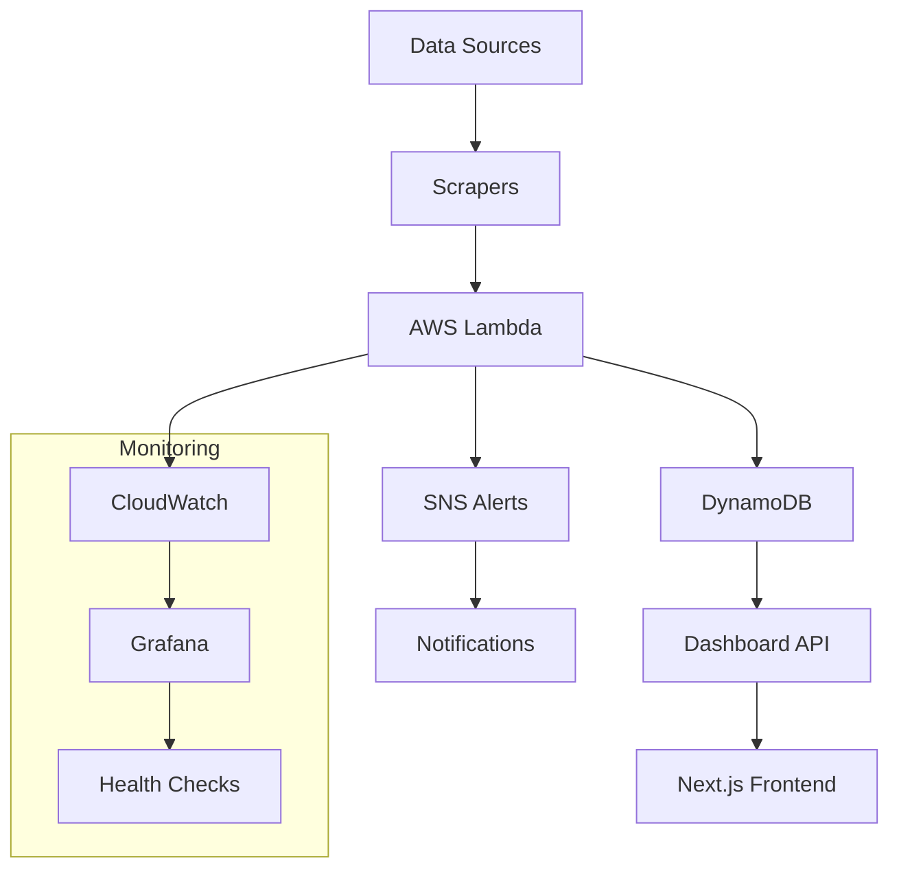

# Boom-Bust Sentinel 🚀

A comprehensive financial market monitoring system that tracks early indicators of boom-bust cycles across multiple asset classes.

## 🎯 Overview

Boom-Bust Sentinel is an automated monitoring system designed to detect early warning signs of financial market cycles by tracking key indicators across:

- **Investment-grade tech bond issuance volumes** 📊
- **BDC (Business Development Company) discount-to-NAV ratios** 💰  
- **Private credit fund asset marks and performance** 📈
- **Bank provisioning for non-bank financial exposures** 🏦

## ✨ Features

- **🔄 Real-time Data Collection**: Automated scrapers for multiple financial data sources
- **🚨 Intelligent Alerting**: Configurable thresholds with multi-channel notifications
- **📱 Interactive Dashboard**: Web-based interface for monitoring and configuration
- **☁️ Robust Infrastructure**: Serverless architecture with comprehensive error handling
- **🧪 Comprehensive Testing**: 80%+ test coverage with integration and deployment tests
- **📊 Advanced Monitoring**: Grafana Cloud integration with custom dashboards
- **🔒 Enterprise Security**: AWS IAM, Secrets Manager, and VPC integration

## 🚀 Quick Start

### Prerequisites
- Python 3.9+
- Node.js 18+
- AWS CLI configured
- Git

### 1. Clone and Setup
```bash
git clone https://github.com/turphAI/ai-boom.git
cd ai-boom

# Set up Python environment
python -m venv venv
source venv/bin/activate  # On Windows: venv\Scripts\activate
pip install -r requirements.txt
```

### 2. Configure Environment
```bash
# Backend configuration
cp .env.example .env
# Edit .env with your API keys and configuration

# Frontend configuration
cd dashboard
cp .env.example .env.local
# Edit .env.local with your database and API configuration
cd ..
```

### 3. Run Tests
```bash
# Run all tests
pytest tests/ -v

# Run with coverage
pytest tests/ --cov=. --cov-report=html
```

### 4. Local Development
```bash
# Start backend services
python main.py

# Start frontend (in another terminal)
cd dashboard
npm install
npm run dev
```

### 5. Deploy to AWS
```bash
# Deploy to development
./deploy.sh serverless --stage dev

# Deploy to production
./deploy.sh serverless --stage prod --frontend
```

## 🏗️ Architecture



### 🔧 Core Components

#### Data Scrapers
- **📈 Bond Issuance Scraper**: Weekly investment-grade tech bond monitoring
- **💼 BDC Discount Scraper**: Daily BDC discount-to-NAV tracking
- **🏛️ Credit Fund Scraper**: Monthly private credit fund analysis
- **🏦 Bank Provision Scraper**: Quarterly bank provisioning monitoring

#### Infrastructure
- **⚡ AWS Lambda**: Serverless function execution with auto-scaling
- **🗄️ DynamoDB**: High-performance NoSQL data storage
- **📢 SNS**: Multi-channel alerting (Slack, Email, Telegram)
- **📊 CloudWatch**: Comprehensive monitoring and logging
- **🔐 Secrets Manager**: Secure credential management

#### Dashboard
- **🖥️ Next.js Frontend**: Modern React-based interface
- **📊 Real-time Metrics**: Live data visualization with charts
- **⚙️ Alert Configuration**: Intuitive alert management
- **🔒 Authentication**: NextAuth.js with secure sessions
- **📱 Responsive Design**: Mobile-friendly interface

## 📁 Project Structure

```
boom-bust-sentinel/
├── 📂 scrapers/              # Data collection modules
│   ├── base.py              # Base scraper class
│   ├── bond_issuance_scraper.py
│   ├── bdc_discount_scraper.py
│   ├── credit_fund_scraper.py
│   └── bank_provision_scraper.py
├── 📂 handlers/              # AWS Lambda handlers
│   ├── bond_issuance_handler.py
│   ├── bdc_discount_handler.py
│   ├── credit_fund_handler.py
│   └── bank_provision_handler.py
├── 📂 services/              # Core business logic
│   ├── alert_service.py
│   ├── metrics_service.py
│   └── state_store.py
├── 📂 utils/                 # Utility functions
│   ├── error_handling.py
│   ├── health_monitor.py
│   └── logging_config.py
├── 📂 tests/                 # Comprehensive test suites
│   ├── test_*_scraper.py    # Unit tests
│   ├── test_*_integration.py # Integration tests
│   └── test_deployment_verification.py
├── 📂 dashboard/             # Next.js frontend
│   ├── src/pages/           # Next.js pages
│   ├── src/components/      # React components
│   └── src/lib/             # Utility libraries
├── 📂 config/                # Configuration management
│   └── environments/        # Environment-specific configs
├── 📂 scripts/               # Deployment and utility scripts
│   ├── health_check.py
│   ├── cost_monitor.py
│   └── test_deployment.py
├── 📂 .github/workflows/     # CI/CD pipelines
├── 📂 terraform/             # Infrastructure as Code
├── 📄 serverless.yml        # Serverless Framework config
├── 📄 DEPLOYMENT.md          # Comprehensive deployment guide
└── 📄 README.md              # This file
```

## 🌍 Environments

### Development (`dev`)
- **Purpose**: Local development and testing
- **Database**: PlanetScale development branch
- **Monitoring**: Basic console logging
- **Alerts**: Console notifications only

### Staging (`staging`)
- **Purpose**: Pre-production testing and validation
- **Database**: PlanetScale staging branch
- **Monitoring**: Grafana Cloud with basic dashboards
- **Alerts**: Slack notifications

### Production (`prod`)
- **Purpose**: Live production system
- **Database**: PlanetScale main branch
- **Monitoring**: Full Grafana Cloud setup with custom dashboards
- **Alerts**: Multi-channel (Slack, Email, SMS, Telegram)

## 🔄 CI/CD Pipeline

Our GitHub Actions pipeline includes:

- **🧪 Automated Testing**: Unit, integration, and E2E tests
- **🔒 Security Scanning**: Vulnerability assessment with Trivy
- **📦 Automated Deployment**: Environment-specific deployments
- **📊 Health Monitoring**: Continuous system health checks
- **💰 Cost Monitoring**: AWS cost tracking and alerts

## 📊 Monitoring & Observability

### Health Checks
```bash
# System health check
python scripts/health_check.py --environment prod

# Lambda-specific health check
python scripts/lambda_health_check.py --environment prod

# Cost monitoring
python scripts/cost_monitor.py --threshold 100
```

### Dashboards
- **Production**: https://your-instance.grafana.net/d/boom-bust-prod
- **Staging**: https://your-instance.grafana.net/d/boom-bust-staging
- **Development**: https://your-instance.grafana.net/d/boom-bust-dev

## 🧪 Testing

### Unit and Integration Tests
```bash
# All tests
pytest tests/ -v

# Specific test categories
pytest tests/test_*_scraper.py -v          # Unit tests
pytest tests/test_*_integration.py -v      # Integration tests
pytest tests/test_deployment_verification.py -v  # Deployment tests

# With coverage
pytest tests/ --cov=. --cov-report=html
```

### Complete System Validation
```bash
# Run complete end-to-end validation (35-55 minutes)
python scripts/run_complete_validation.py

# Individual validation phases
python tests/test_end_to_end_integration.py     # E2E integration tests
python scripts/system_integration.py            # System integration
python scripts/load_testing.py                  # Performance testing
python scripts/final_system_validation.py       # Final validation
```

### Deployment Verification
```bash
# Test staging deployment
python scripts/test_deployment.py --stage staging

# Test production deployment
python scripts/test_deployment.py --stage prod
```

**Validation Success Criteria**:
- Overall Success Rate: ≥ 80%
- Performance Score: ≥ 70/100
- System Integration: ≥ 80% success rate
- Production Readiness: ≥ 80/100

For detailed testing documentation, see [Integration Testing Guide](docs/integration_testing.md).

## 🚀 Deployment

### Quick Deployment
```bash
# Development
./deploy.sh serverless --stage dev

# Staging with frontend
./deploy.sh serverless --stage staging --frontend

# Production (full deployment)
./deploy.sh serverless --stage prod --frontend
```

### Manual Deployment
```bash
# Backend only
serverless deploy --stage prod

# Frontend only
cd dashboard && vercel --prod
```

For detailed deployment instructions, see [DEPLOYMENT.md](DEPLOYMENT.md).

## 🤝 Contributing

We welcome contributions! Please follow these steps:

1. **Fork** the repository
2. **Create** a feature branch (`git checkout -b feature/amazing-feature`)
3. **Commit** your changes (`git commit -m 'Add amazing feature'`)
4. **Push** to the branch (`git push origin feature/amazing-feature`)
5. **Open** a Pull Request

### Development Guidelines
- Write tests for new features
- Follow Python PEP 8 style guidelines
- Use TypeScript for frontend development
- Update documentation for significant changes
- Ensure all CI checks pass

## 📋 Branch Structure

- **`main`**: Production-ready code
- **`dev`**: Development branch for new features
- **`tdmBoom`**: Local development branch
- **`feature/*`**: Feature development branches
- **`hotfix/*`**: Production hotfixes

## 📄 Documentation

- **[📚 Deployment Guide](DEPLOYMENT.md)** - Complete deployment instructions
- **[🔧 Configuration Guide](docs/configuration.md)** - System configuration
- **[📊 Monitoring Setup](docs/monitoring_setup.md)** - Monitoring configuration
- **[🚨 Error Handling](docs/error_handling_implementation.md)** - Error handling patterns

## 🆘 Support

For support and questions:

- **🐛 Issues**: Create an issue in the GitHub repository
- **📖 Documentation**: Check the `docs/` directory
- **🚀 Deployment**: Review [DEPLOYMENT.md](DEPLOYMENT.md) for common issues
- **💬 Discussions**: Use GitHub Discussions for questions

## 📊 Project Status

- ✅ **All 14 specification tasks completed**
- ✅ **80%+ test coverage achieved**
- ✅ **Production-ready deployment**
- ✅ **Comprehensive monitoring setup**
- ✅ **CI/CD pipeline operational**

## 📈 Performance Metrics

- **⚡ Lambda Cold Start**: < 2 seconds
- **📊 API Response Time**: < 500ms average
- **🔄 Data Processing**: 99.9% success rate
- **💰 Monthly AWS Cost**: < $50 (typical usage)

## 🔒 Security

- **🔐 IAM**: Least-privilege access policies
- **🗝️ Secrets**: AWS Secrets Manager integration
- **🛡️ VPC**: Optional VPC deployment
- **🔍 Scanning**: Automated security vulnerability scanning

## 📜 License

This project is licensed under the MIT License - see the [LICENSE](LICENSE) file for details.

---

**Built with ❤️ by the Boom-Bust Sentinel Team**

*Monitoring financial markets, one data point at a time.* 📊✨