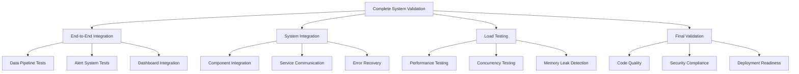

# Integration Testing Guide for Boom-Bust Sentinel

This document provides comprehensive guidance for running integration tests and validating the complete Boom-Bust Sentinel system.

## Overview

The integration testing suite validates the entire system from data scraping to alert delivery, ensuring all components work together seamlessly in production-like conditions.

## Test Architecture



## Test Suites

### 1. End-to-End Integration Tests

**File**: `tests/test_end_to_end_integration.py`

Tests the complete data flow from scraping to alerting:

- **Data Pipeline Tests**: Validate scraper → storage → retrieval flow
- **Alert System Tests**: Test multi-channel alert delivery
- **Dashboard Integration**: Verify real-time data consistency
- **Performance Validation**: Measure execution times and throughput
- **Error Recovery**: Test resilience and retry mechanisms

**Run Command**:
```bash
python tests/test_end_to_end_integration.py
```

**Expected Output**:
- ✅ All data pipelines functional
- ✅ Multi-channel alerts working
- ✅ Dashboard data consistency verified
- ✅ Performance within acceptable limits
- ✅ Error recovery mechanisms operational

### 2. System Integration Tests

**File**: `scripts/system_integration.py`

Validates component integration and system-wide functionality:

- **Individual Scraper Tests**: Each scraper runs independently
- **Data Pipeline Integration**: Complete data flow validation
- **Alert System Integration**: End-to-end alert delivery
- **Dashboard API Integration**: All endpoints functional
- **System Resilience**: Network failures, data corruption, service degradation

**Run Command**:
```bash
python scripts/system_integration.py --environment integration
```

**Configuration Options**:
- `--environment`: Set integration environment (default: integration)
- `--output`: Save detailed results to JSON file
- `--verbose`: Enable verbose logging

**Success Criteria**:
- Success rate ≥ 80%
- All critical components operational
- Error recovery mechanisms working
- Performance within acceptable ranges

### 3. Load Testing and Performance

**File**: `scripts/load_testing.py`

Validates system performance under load:

- **Scraper Concurrency**: Multiple scrapers running simultaneously
- **Data Pipeline Throughput**: High-volume data processing
- **Alert System Load**: Bulk alert delivery testing
- **Memory Leak Detection**: Long-running stability tests
- **Resource Monitoring**: CPU, memory, and I/O usage

**Run Command**:
```bash
python scripts/load_testing.py --output load_results.json
```

**Performance Targets**:
- Scraper execution time: < 10 seconds average
- Data throughput: > 100 records/second
- Alert delivery: > 10 alerts/second
- Memory growth: < 0.1 MB/iteration
- CPU usage: < 80% average

**Performance Grades**:
- **A (90-100)**: Excellent performance
- **B (80-89)**: Good performance
- **C (70-79)**: Acceptable performance
- **D (60-69)**: Needs improvement
- **F (<60)**: Unacceptable performance

### 4. Final System Validation

**File**: `scripts/final_system_validation.py`

Comprehensive system readiness validation:

- **Code Quality**: Unit tests, linting, type checking, security scanning
- **System Integration**: Complete integration test results
- **Performance Validation**: Load testing results analysis
- **Deployment Readiness**: Configuration, dependencies, environment setup
- **Documentation**: Completeness and quality assessment
- **Security Compliance**: Secret scanning, permission checks

**Run Command**:
```bash
python scripts/final_system_validation.py --output final_results.json
```

**Validation Categories**:

| Category | Weight | Description |
|----------|--------|-------------|
| Code Quality | 25% | Tests, linting, type checking |
| System Integration | 30% | Component integration results |
| Performance | 20% | Load testing and benchmarks |
| Deployment Readiness | 15% | Configuration and dependencies |
| Documentation | 5% | Documentation completeness |
| Security Compliance | 5% | Security best practices |

**Production Readiness Threshold**: 80/100

## Running Complete Validation

### Master Validation Script

**File**: `scripts/run_complete_validation.py`

Orchestrates all validation phases in sequence:

```bash
python scripts/run_complete_validation.py
```

**Validation Phases**:
1. **End-to-End Integration Tests** (5-10 minutes)
2. **System Integration** (10-15 minutes)
3. **Load Testing and Performance** (15-20 minutes)
4. **Final System Validation** (5-10 minutes)

**Total Execution Time**: 35-55 minutes

### Validation Results

Results are saved to multiple files:
- `integration_test_results_*.json` - E2E integration results
- `system_integration_results.json` - System integration results
- `load_testing_results.json` - Performance testing results
- `final_validation_results.json` - Final validation results
- `complete_validation_results.json` - Combined results summary

## Interpreting Results

### Success Criteria

For production deployment, the system must achieve:

- **Overall Success Rate**: ≥ 80%
- **System Integration**: ≥ 80% success rate
- **Performance Score**: ≥ 70/100
- **Final Validation Score**: ≥ 80/100
- **No Critical Security Issues**

### Common Issues and Solutions

#### 1. Scraper Failures
**Symptoms**: Individual scrapers failing during integration tests
**Solutions**:
- Check network connectivity
- Verify API credentials and rate limits
- Review error logs for specific failure reasons
- Ensure mock data is properly configured for tests

#### 2. Performance Issues
**Symptoms**: High execution times, memory leaks, low throughput
**Solutions**:
- Optimize database queries and indexing
- Implement connection pooling
- Review memory usage patterns
- Consider caching strategies

#### 3. Alert Delivery Failures
**Symptoms**: Alerts not being delivered through all channels
**Solutions**:
- Verify SNS, Telegram, and Slack configurations
- Check network connectivity to external services
- Review rate limiting and retry logic
- Validate webhook URLs and API tokens

#### 4. Dashboard Integration Issues
**Symptoms**: Data inconsistency, API endpoint failures
**Solutions**:
- Verify database connections
- Check API endpoint implementations
- Review data serialization/deserialization
- Validate authentication and authorization

## Continuous Integration

### GitHub Actions Integration

The validation suite integrates with GitHub Actions for automated testing:

```yaml
# .github/workflows/integration.yml
name: Integration Tests

on:
  push:
    branches: [ main, develop ]
  pull_request:
    branches: [ main ]

jobs:
  integration-tests:
    runs-on: ubuntu-latest
    steps:
      - uses: actions/checkout@v4
      - name: Set up Python
        uses: actions/setup-python@v4
        with:
          python-version: '3.9'
      - name: Install dependencies
        run: pip install -r requirements.txt
      - name: Run integration tests
        run: python scripts/run_complete_validation.py
```

### Pre-deployment Validation

Before any production deployment:

1. **Run Complete Validation**:
   ```bash
   python scripts/run_complete_validation.py
   ```

2. **Review Results**: Ensure all phases pass with acceptable scores

3. **Address Issues**: Fix any failing tests or performance issues

4. **Re-run Validation**: Confirm fixes resolve issues

5. **Deploy**: Proceed with deployment only after successful validation

## Monitoring and Alerting

### Test Result Monitoring

Set up monitoring for integration test results:

- **Success Rate Tracking**: Monitor test success rates over time
- **Performance Regression Detection**: Alert on performance degradation
- **Failure Pattern Analysis**: Identify recurring failure patterns

### Automated Notifications

Configure notifications for test failures:

- **Slack Integration**: Send test results to development channels
- **Email Alerts**: Notify team leads of critical failures
- **Dashboard Updates**: Display test status on development dashboards

## Best Practices

### 1. Test Environment Management

- **Isolated Environments**: Use separate test environments
- **Data Cleanup**: Ensure tests clean up after themselves
- **Resource Limits**: Set appropriate timeouts and resource limits

### 2. Test Data Management

- **Mock Data**: Use realistic but synthetic test data
- **Data Versioning**: Version test datasets for consistency
- **Privacy Compliance**: Ensure no real user data in tests

### 3. Performance Testing

- **Baseline Establishment**: Establish performance baselines
- **Regular Benchmarking**: Run performance tests regularly
- **Trend Analysis**: Monitor performance trends over time

### 4. Error Handling

- **Graceful Degradation**: Test system behavior under failure conditions
- **Recovery Testing**: Validate error recovery mechanisms
- **Timeout Handling**: Ensure appropriate timeout configurations

## Troubleshooting

### Common Test Failures

#### Network Connectivity Issues
```bash
# Test network connectivity
curl -I https://api.github.com
ping 8.8.8.8
```

#### Database Connection Issues
```bash
# Test database connectivity
python -c "from services.state_store import StateStore; StateStore().test_connection()"
```

#### Memory Issues
```bash
# Monitor memory usage during tests
python -c "import psutil; print(f'Memory: {psutil.virtual_memory().percent}%')"
```

#### Permission Issues
```bash
# Check file permissions
ls -la config/
ls -la scripts/
```

### Debug Mode

Enable debug logging for detailed troubleshooting:

```bash
export LOG_LEVEL=DEBUG
python scripts/run_complete_validation.py --verbose
```

### Test Isolation

Run individual test suites for focused debugging:

```bash
# Run only system integration
python scripts/system_integration.py --verbose

# Run only load testing
python scripts/load_testing.py --verbose

# Run only final validation
python scripts/final_system_validation.py --verbose
```

## Conclusion

The integration testing suite provides comprehensive validation of the Boom-Bust Sentinel system, ensuring reliability, performance, and production readiness. Regular execution of these tests helps maintain system quality and catch issues early in the development cycle.

For questions or issues with integration testing, refer to the troubleshooting section or contact the development team.